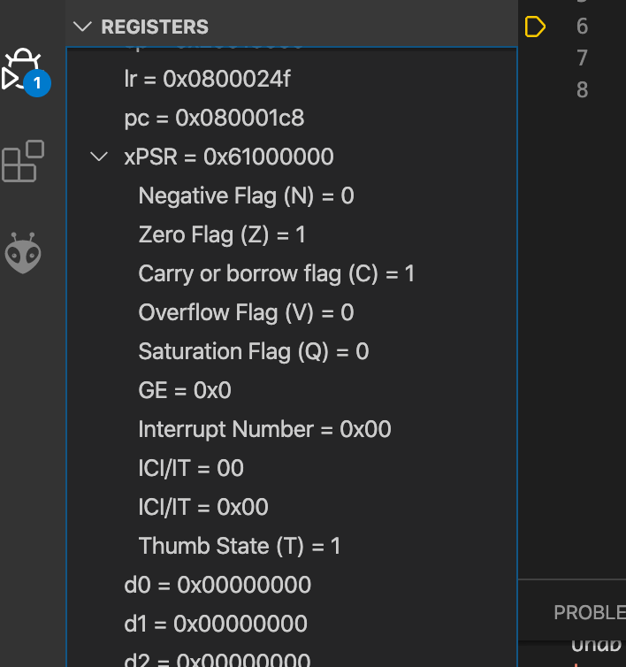

# Week 3 -- Status Registers + Branching (Hearthstone)


[Hearthstone](https://en.wikipedia.org/wiki/Hearthstone) is a card-game-style computer game where you kill monsters and win points, and it seems to be pretty popular with the kids these days. This week, you’re going to create our very own simplified version of Hearthstone that we’ll call Hearthpebble.

>**NOTE** In this lab you’ll be working in pairs, so say hi to the person sitting next to you—they’ll be your partner for this lab. Ask them what their favourite card game is, and whether they’ve ever thought of writing a computer-program version of it?

## Exercise 1: Characters and health potions
But before you write any more code, think: what are the minimum features that you’ll need to put in your program to create a game like this?

Whilst there are likely many ideas you've thought of, at the very least, the game needs:

* **a character**, with some number of hit points
* **an action** that our character can perform

This stuff is so common in computer games that you probably don’t even think of it, but discuss with your partner: using what you’ve learned so far about programming your discoboard, how might you keep track of your character’s hit points (HP), and how could you represent an action in your program?


With your partner, write a program to store the character’s HP in the register r1 with an initial value of 100.

## Exercise 2: Adding functionality

Now that you’re storing the HP, here’s the first action in the game:

* **Healing potion**: add 50HP (hp := hp + 50)
With your partner, write an assembly instruction for this action. Remember to look at the cheat sheet—nobody expects you to recall this stuff perfectly from memory.

Step through your program — what’s the value in the hit point register after your “action” instruction has occurred? Does that seem right?

At this point, the Hearthpebble world only has one action, so the only way for the game to proceed is to keep performing that action. We can do that with a **branch instruction**, which we've discussed over the last 2 weeks. This instruction tells your discoboard to “branch” (sometimes called a jump on other CPU types) to a different part of the code. 

You can specify the “destination” of the branch in a bunch of different ways, including using a label, or a constant value (if you know exactly what address you want to go to ahead of time) or even the address in a register. 

If you’ve wondered how to get your program to do something other than just keep following the instructions from top to bottom, branching is the answer. If you need a reminder of how branching might work, heres a how an infiinite loop might look in assembly.

```armasm
@ We declare our label
my_label:
  @ [CODE GOES HERE]
  @ Start the function again by branching
  b my_label
```

Add a label and a branch instruction to modify your program so that the character keeps drinking healing potions (one after the other) indefinitely.  

To test your program, hit the continue button in the debug toolbar and let the program run for a while, pausing every now and again to check the players HP value — what do you notice? 

The behaviour you are seeing is related to a topic we breifly covered last week. We'll discuss this later in the lab

## Exercise 3: enriching our game world

At the moment, Hearthpebble is pretty boring. Let’s add mana and stamina attributes to the character—pick a couple of registers (r2 and r3 are probably good choices) and initialise them to some values. Pick some values which seem good to you, you’re the game designer now!

Even these small additions open up some interesting new actions, for example:

* **fireball**: remove 20HP 🔥
* **frenzy**: remove 20HP, but add 40 stamina 💨
* **magic poison**: do double the character’s mana attributes in damage (hp := hp - 2 * mana) 🧪
* **strength from weariness**: (hp := hp + (mana - stamina)^2) 💪
* **eye of Zardok**: (stamina := (hp * stamina) / 100; mana := (mana / 16)^3) 👁️

**Write the assembly code for each of these actions.**

Note that these ones (unlike the simpler actions from the previous section) might require more than one instruction, so feel free to use whitespace and comments (any text on a line following the `@` character is a comment) to make things clearer.

```armasm
@ This is a comment
```

You can use whatever registers you like, but make sure that the destination register of each instruction isn’t already holding something important (like your HP!). For more complex mathematical expressions, you need to break it down into smaller steps. Use a pencil and paper if that helps.

Now, **create at least one action of your own**. Give it a name, figure out what it does to the game state and implement it in assembly code.

## Exercise 4: Enter player 2

You’ve now got the building blocks for Hearthpebble in place, but there’s still one thing clearly missing—an opponent to play against! To add a second player you’ll have to set 3 more registers aside to hold the second player’s health, mana and stamina. Be careful about which registers you use—make sure that any of the “action sequences” don’t accidentally clobber player 2’s stuff. You can make the structure of the code by adding some labels to the code, something like:

```armasm
main:

player_1_init:
@ player 1 init code

player_2_init:
@ player 2 init code

player_1_actions:
@ player 1 actions code

player_2_actions:
@ player 2 actions code
```

To make the 2-player version of the game work properly, you’ll really need to use the branch (b) instruction. Your program should initially execute the init instructions (first for player 1, then for player 2) and the ‘ping-pong’ between the player 1 and player 2 actions until one of the players is dead. If you’re doing lots of copy-pasting of the same (action) instructions, then you’re doing it wrong!

Pair up with your partner and decide on some “house rules”, e.g. no actions which are too powerful. Remember, it’s not about winning, but about understanding what’s going on.

Once you’ve agreed on how your 2-player game will work, create your 2-player game by filling out the above “code skeleton” with your partner.

Together you can play (run) the program as many times as you like, watching the all-important HP registers to see how the game evolves. When you’ve figured out what the outcome is in the current version of the game, work together with your partner to find new actions for each other to take so that you end up with a different outcome.

## Excersise 5 : Status registers

You’re probably getting good at watching registers in the register view to figure out who’s winning and who’s losing. But that’s really the sort of thing your program should be doing for you automatically. In the final part of this lab, we're going to look a bit more indepth at something called the status register.

You’ve seen over the last few weeks (and every time you look at the cheat sheet) that most of the ARM assembly instructions can be made to execute “conditionally” using a one or two letter suffix. This is how we can make things like if statements in assembly!

> Discuss with your partner: how does your computer allow conditional branching? Why do we need to use the cmp command before conditionally branching?

Answer: **The status register!**

On your discoboard exists a program status register (PSR) for keeping track of various important bits of state associated with the current computation. Essentially specific bits in the status register indicate different peices on information to us about the latest computation completed on our board! Pretty neat hey!

The 4 highest bits in the register are the NZCV flags:

* **Negative**: The result was a negative number
* **Zero**: The result is zero
* **Carry**: Set if the result of an operation requires a carry out bit
* **Overflow**: Set if the result of the operation overflows the min/max values able to be stored in a 32 bit register.

This [stackoverflow post](https://stackoverflow.com/questions/23990071/sign-carry-and-overflow-flag-assembly/24002847#24002847) also has a nice “clock” animation to show how all the condition codes in the status register work.

If this is a bit confusing, thats ok! Its a complicated concept! Let one of our tutors know and we will explain it on the board!

We can check out this register and the flags right now by looking in the register view and expanding the xPSR register.



To find out more about the result of an operation, most assembly instructions can be followed by a `s` which denotes that you could like to set flags based on the result of the operation.

Before we move on with our game, with your partner, write a series of simple programs (e.g. mov some values into registers, then do an arithmetic operation on those registers) to set:

* the negative flag bit 
* the zero flag bit 
* the carry flag bit and 
* the overflow flag bit. 

Your program should look like this:

```armasm
@ set the negative flag

... your instruction(s) go here ...

@ set the zero flag

... your instruction(s) go here ...

@ set the carry flag

... your instruction(s) go here ...

@ set the overflow flag

... your instruction(s) go here ...
```

It might seem like this carry/overflow stuff isn’t worth worrying about because it’ll never happen in real life. But that’s not true. In 2013 the actual Hearthstone game was found to contain an integer overflow bug. It can cause more serious problems too, like literally causing rockets to explode. So understanding and checking the status flags really matters :)

Discuss with your partner, what does the following instruction do? You can look at your cheat sheet if you like (its got some hints about flags in the right hand column).

```armasm
bne end_loop
```

Using the cheatsheet and what you've learnt about the status registers, which of the beq instructions below do you think will actually trigger the branch to the end_loop?

```armasm
movs r0, #100
beq end_loop  @ conditional branch 1
subs r0, #200
beq end_loop  @ conditional branch 2
adds r0, #100
beq end_loop  @ conditional branch 3
```
Step through it on paper. Can you change the condition (i.e. change the eq to something else) to execute conditional branch 2? How about branch 1? Have a look at the “Condition codes” section of the cheat sheet to familiarise yourself with all the options. You could also copy this into your code to see the actual registers and whats happening!

Its important that you understand whats happening here. So if you're confused call one of the tutors over!

## Extension

Now, in the final part of this lab / the extension activity, you’ll pick up on the status register stuff to make your game check if either of the players has died before gameplay continues.

1. at the end of player 1’s turn, check if player 2 is dead—if so, branch to a player_1_victory loop at the end (you’ll have to add this in, too)
1. do the same (in reverse) at the end of player 2’s turn
1. if both players are still alive at the end of player 2’s turn, branch back up to the start of player 1’s turn and start again

Congratulations! Play with your partner, find a new partner if others are finishing up, try to win, try to lose, try to last for exactly 3 turns, try to cheat — use your imagination!