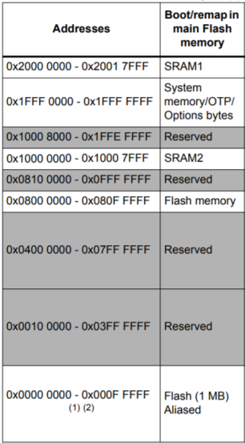

# Week 3 -- Stacks and Memory

## Stacks:
Your discoboard contains one pre-defined stack. This can be used with two instructions

### Push

`Push` moves the values from the registers onto the stack without wiping the 

```armasm
push {<register(s)>}
```
e.g.
```armasm
@ single register
push {r2}

@ multiple registers
push {r2,r4}

@ range of registers (inclusive)
push {r0-r3}
```

### Pop

`Pop` removes the top 4 bytes from the stack and moves it into the register passed in

```armasm
pop {<register(s)>}
```
e.g.

```armasm
@ single register
pop {r2}

@ multiple registers
pop {r2,r4}

@ range of registers (inclusive)
pop {r0-r3}
```

---

## Memory:



Your discoboard contains 1MB of general usage memory. This memory can be interacted with using `ldr` and `str`.

### Load
```armasm
ldr <src>, [<dest>]
@ Where src is a register where you want the value from memory to be stored
@ and dest is a register containing the memory address of the stored value
```
e.g.
```armasm
mov r1, 0x2000000
ldr r0, [r1]
```

<br>

### Store
```armasm
str <src>, [<dest>]
@ Where src is a register containing the value you want to store
@ and dest is a register containing the memory address to store in
```
e.g.
```armasm
mov r0, #3
mov r1, 0x2000000
str r0, [r1]
```

<br>

### .data

.data tells the compiler that anything below it is intended to be data -- as opposed to code. We can then use labels -- and the load pseudoinstruction -- to load the addresses of the pieces of data within the data section. We can then, finally read and modify the data within memory by using the `ldr` and `str` operations with that address.

e.g.
```armasm
ldr r0, =arrayStart @ moves the memory address of the data into r0
ldr r1, [r0]        @ moves the first word (4 bytes) into r1
add r0, 4           @ adds 4 bytes to the memory pointer
ldr r2, [r0]        @ moves the second word (4 bytes) into r1

@ r1 will contain 0xDEADBEEF
@ r2 will contain 0xC0FFEE00

.data
arrayStart:
    .word 0xDEADBEEF
    .word 0xC0FFEE00
```


## Exercise 1 - 0xDEADBEEF

1. Open DEADBEEF Template
1. Run in debug
1. Step through the code
1. Find where `0xDEADBEEF` has been written to memory
1. Inspect the memory using the memory inspector
1. Discuss what you find with those around you.

## Exercise 2 - Recursive Factorial

Open the factorial template and write a function that can take a value in `r0` and produce the factorial of this number, storing it in `r0` recursively.

**Hint:** Is the link register, `lr`, being pushed onto the stack

## Exercise 3 - Recursive Fibonacci

Open the fibonacci template and write a function that can take a value in `r0` and produce the fibonacci of this number, storing it in `r0` recursively.