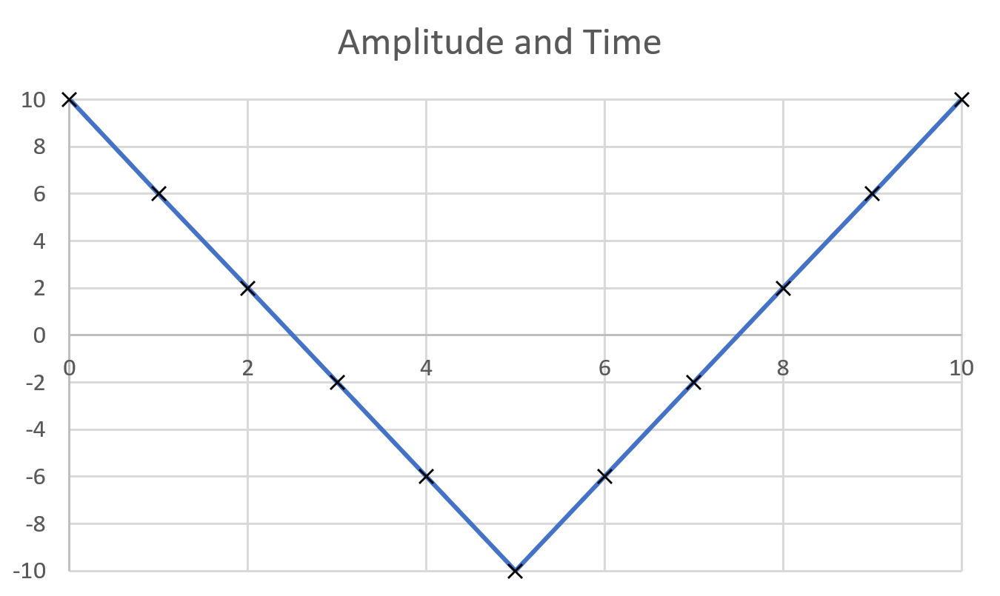

# Week 5 - Audio

This week we'll be moving on to something exciting -- playing sounds out of the audio jack on the discoboard.

It sounds like quite a complex task, but we'll make sure to take it slow, and explain things that need to be explained.

First off, let's talk about sound.

## So, what is audio?

It's likely that you've seen this kind of thing before in audio editing software, or something:

but what does it represent?

Well, as most of you probably know, it represents a *waveform* -- a digital representation of all of the different waves needed to make the sound that you hear.

Each *wave* has a centre line -- at zero -- and the points along the *wave* are different outputs at a time that varies based on the *sample-rate*.

Let's take a really simple example:



Here, assuming the time (x axis) is measured in milliseconds, and the output has a *range* from 10 to -10, we have a *triangle* wave, with a *period* of 10ms.

Since we have one point every millisecond, the placement of the markers also implies a *sample-rate* of 1000hz -- or 1000 audio changes per-second.

Finally, a wave with a *period* of 10ms, will have a *frequency* of 100hz: *frequency (hz) = 1000/period (ms)*.

If we were to play the same sounding wave, at a sample rate of 2000hz (double our sample-rate), we would need *double* the samples:


To reiterate then:

* *sample rate* is the number of discrete points that an audio device outputs per second.

* *frequency* is the number of oscilations (that is, full-cycles) that a specific wave will undertake per second.

* *period* is the amount of time that it takes a specific wave to do one oscilation.

* *output* is the actual digital signal to output (usually converted to volts).

* *frequency* and *period* are both related (frequency is the reciprocal of period, and obviously the opposite is true).

There's one more major thing we need to understand before we can think about making sound:

In order to make a sound with a specific *frequency* we need to know the *sample-rate* that we are working with, in order to find out the number of *samples per wave*. Let's say, for instance, that we're working with a device that has a sample rate of 44000hz.

If we want to play a wave with a *frequency* of 440hz, we're going to need *100 samples-per-wave* to produce that sound, as *44000 / 440 = 100*.

Similarly, if we wanted to play a wave with a *frequency* of 880hz, we'd need *50 samples-per-wave* to produce that sound, since *44000 / 880 = 50*. This should hopefully begin to make intuitive sense -- 880hz is *double* the frequency of 440hz, so as a result, since we have the same *sample-rate* we can only use *half* the number of *samples-per-wave*.

Hopefully, that all makes sense. To make sure you get understand basically what's going on, here's one last thing:

The Discoboard has a sample-rate of *48000hz*. How many *samples-per-wave* will you need to use in order to produce a sound that is *240hz*?

### One final note on waves

We've talked about output as being the representation of the output of the wave, at a certain point. The last really important thing to know about sound is this: the volume of a sound is not proportional to the *average output*, which, at first may not make sense.

But think for a minute about sound, as if it were waves on the ocean. Here, zero output is the average level of the sea. Positive output is therefore when the water is above this average, and negative output is when the water is below this average.

If the water in some location spends more time above the "average" line, does that imply that the *waves* are larger?


Hopefully, not. The size of each *wave* is dependent on the difference between the highest output -- at the *peak* -- and the lowest output -- the *trough*. This metric is called the *amplitude* of the wave.

## Making a sound

Download the making sound [template](Making-Sound-Template.zip) (or pull from GIT), and open it in Visual Studio Code, as per usual.

You'll notice that we've provided more sample-code than usual this time.

```armasm
.syntax unified
.global main

.type main, %function
main:
  bl init
  b loop
.size main, .-main

.type loop, %function
loop:
  nop @your code here
  b loop
.size loop, .-loop
```

Your challenge now, is to make a triangle wave, at around 400hz. In order to do this:

### Outputting Audio

To output audio we need to call the function `BSP_AUDIO_OUT_Play_Sample`:

```armasm
bl BSP_AUDIO_OUT_Play_Sample
```

When we do this, we pass 16 bit integer to this function in r0, that represents the output. This means that the minimum value we can set is -32769; and likewise, the maximum value is 32768.

It's also worth noting that if we call this function before it's time to output a sample (according to our *sample-rate* of 48000hz), the discoboard will wait until it's time to output the value. That is to say, that no matter how fast your code runs, it will be limited to running 48000 times per second.


This is really useful, because it means we don't really have to worry about how long we wait before producing another value, and we can easily calculate (at least for simple wave-generators / *synthesizers*) exactly which numbers to go between, given this sample rate.

It's worth noting that for very complex synthesizers, we're going to have to start worrying about how much time it takes to generate values.

### Triangle Waves

A triangle wave, as illustrated before, is a wave made up of two *linear* components.


An up-slope, a peak in the middle, and then a down slope.

Each linear component can be represented in standard form as: *y=mx+b* or: __output = sample number x stride + Initial Amplitude__.

### An example calculation (skip this if you want!)

For the example of a 480hz wave, since we have a sample rate of 48000hz, we have 100 samples per wave.

This is nice: it means that for 50 samples we're climbing up to our peak amplitude, and then for the next 50, we're declining again.

Let's try to go for a range/amplitude of `60,000`.

#### Up slope

We need an equation that is `-30,000` at `sample=0`, and `30,000` at `sample=50`.

So, `output = sample x 1200 - 30000` is our way to go.

In Python then:

```py
def generateWave(sample):
    if sample <= 50:
        return (sample * 1200) - 30000
```

#### Down slope

We need an equation that is `30,000` at `sample=50`, and `-30,000` at `sample=100`.

So, `output = (50-sample) x 1200 + 30000`.

In Python, then:

```py
def generateWave(sample):
    if sample <= 50:
        return (sample * 1200) - 30000
    else:
        return (50 - sample) * 1200 + 30000
```

Sure enough, if we were to implement that, we'd get a wave like this:


Exactly what we want.

## Activity

Now, try to implement a wave that is as close to a 440hz triangle wave as possible. You'll have to do the maths yourselves -- as well as implement the code in assembly -- but it should be possible with everything we've gone through.

## Extension Activity

You may have noticed that it's impossible to make a 440hz wave nicely (as the discoboard has a sample rate of 48000hz).

Try to get around this somehow -- think about methods you could use so that your wave was (on average) closer to the target of 440hz.