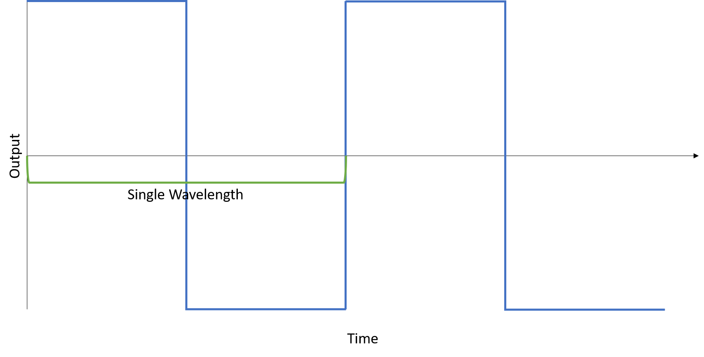
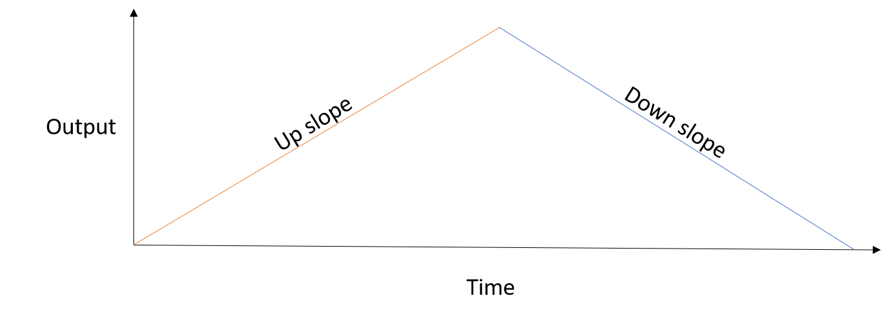
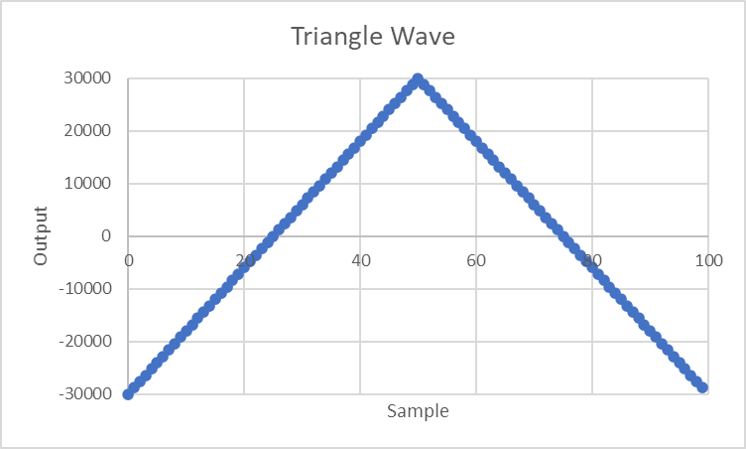

# Week 6 - More Audio

Most of this week will be spent making sure everyone understands the concepts we went over last week.

## The Maths

Last week, our task was to make a 440Hz triangle wave. Knowing that the *sample-rate* of our discoboard is 48000hz, the maths works out like so:

48000/440 = 109 + 1/11th.

As such, there should be around 109 samples used in each wave that we output.

Let's now try implementing this for a square wave:



A square wave is a simple form of wave -- it merely plays at max output half of the time, and min output the other half of the time.

Now, let's get to converting this to code.

## From Maths to Code

As we did last week, we're going to once again write a "generator function" first.

In this case, it may look like this:

```py
def generateWave(sample):
    if sample <= 54:
        return 30000
    else:
        return -30000
```

This will return the maximum output for the first half of the wave, and the minimum output for the second.

Now, we will need to work on writing code around this function -- to increase our sample, and produce the audio output:

```py
initialize() #call to init
sample = 0

while True:
    sample += 1

    value = generateWave(sample)

    outputAudio(value) #this is to represent our call to BSP_AUDIO_OUT_Play_Sample

    if sample > 109: #keep our sample number less than the number of samples in the wave
        sample -= 109
```

## From Code to Machine Code

Now that we've got a basic understanding of how this should work in a high level language like Python, we've got to think about how we're going to lower it to machine code.

```armasm
.type main, %function
main:
    bl init                         @ initialize()
    mov r1, 0                       @ sample = 0
.size main, .-main

.type loop, %function
loop:                               @ while true
    add r1, 1                       @     sample += 1
    
    @ load parameter
    @ into r0, and call
    @ generate_wave
    mov r0, r1                      @     
    bl generate_wave                @     value = generateWave(sample)

    push {r1}
    bl BSP_AUDIO_OUT_Play_Sample    @     outputAudio(value) #(Remember, this call is blocking.)
    pop {r1}

    cmp r1, #109                    @     if sample < 109:
    blt loop                        @       break #(repeats loop without modifying sample)
    sub r1, #109                    @     sample -= 109

    b loop                          @ end while
.size loop, .-loop

.type generate_wave, %function
generate_wave:
    cmp r0, #54                     @ if sample <= 54:
    bgt else
    ldr r0, =#30000
    bx lr                           @   return 30000
    else:                           @ else:
    ldr r0, =#-30000                
    bx lr                           @   return -30000
.size generate_wave, .-generate_wave
```

## Activity 1: Adapting to different waves

Try now, to adapt the above code with a square wave at 440hz, to a square wave at 500hz. This'll require making a few changes to the code, and doing the maths to figure out how many samples to play. It should be reasonably easy to do, though.

## Activity 2: New waveforms

Last week, we figured out this wave generator function to make a triangle wave, at 480hz.

```py
def generateWave(sample):
    if sample <= 50:
        return (sample * 1200) - 30000
    else:
        return (50 - sample) * 1200 + 30000
```

First, try to implement this as is, in place of the wave-generator function we currently have. Next, try to modify it so that it too runs at 500hz.

If you get stuck, here's a recap on Triangle Waves from last week:

### Triangle Waves

A triangle wave, is a wave made up of two *linear* components.



An up-slope, a peak in the middle, and then a down slope.

Each linear component can be represented in standard form as: *y=mx+b* or: __output = sample number x stride + Initial Amplitude__.

### An example calculation (skip this if you want!)

For the example of a 480hz wave, since we have a sample rate of 48000hz, we have 100 samples per wave.

This is nice: it means that for 50 samples we're climbing up to our peak amplitude, and then for the next 50, we're declining again.

Let's try to go for a range/amplitude of `60,000`.

#### Changes in Output Value

To calculate out amplitude change per sample, we divide our total range (in this case, `60,000`) by the number of samples in a single slope (up or down) (in this case, `50`). This leaves us with a difference of `1200` between each output, which we'll use later on.

#### Up slope

We need an equation that is `-30,000` at `sample=0`, and `30,000` at `sample=50`.

So, `output = sample x 1200 - 30000` is our way to go.

In Python then:

```py
def generateWave(sample):
    if sample <= 50:
        return (sample * 1200) - 30000
```

#### Down slope

We need an equation that is `30,000` at `sample=50`, and `-30,000` at `sample=100`.

So, `output = (50-sample) x 1200 + 30000`.

In Python, then:

```py
def generateWave(sample):
    if sample <= 50:
        return (sample * 1200) - 30000
    else:
        return (50 - sample) * 1200 + 30000
```

Sure enough, if we were to implement that, we'd get a wave like this:



Exactly what we want.

In order to implement this in assembly, we need to keep track of which sample we're currently generating the output for, generate the output for that sample and finally call `BSP_AUDIO_OUT_Play_Sample`, but all of that should be reasonably doable:

A simple loop, a function call, and then another function call should be all that's needed.

Remember that the stack exists too: `push` for putting things on the stack, and `pop` for taking them off, and it should be reasonably easy to get a correct sound out.

## Activity 3: Timing
Finally, we're going to incorporate some timing, by making a program that:

1. Plays a 440hz triangle wave for 1 second
1. Plays a 880hz triangle wave for 1 second
1. Repeats forever

By keeping in mind the discoboard's sample rate (48000hz), and keeping tabs on how many samples have played, this should be a reasonably easy task.

## Extension:
Modify your prior solutions (1 through 3), such that they can play any frequency given, by only editing single values.