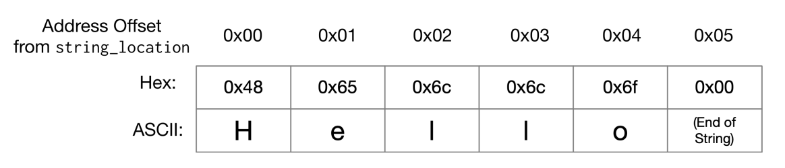

# Week 8 - Challenges + Memory offsets!

Over the last 7 weeks we've looked at various concenpts that have hopefully given you a better understanding about how embedded systems work. Over the past weeks we've touched on the following concepts:

* Assembly language basics
* Branching and Conditional code execution
* Stack and Memory
* Basic Audio Wave generation

In todays session, we are going to develop these skills through some challenges that will put your knowledge to the test! These challenges are designed to test your knowledge so don't be disheartened if the solutions aren't clearly laid out infront of you :)

## Exercise 1

Lets start with a warm up. Write a recursive assembly function (starting at the label pow) which calculates the power function:

`pow(x, y) = x^y`

for positive integers x and y.
Add comments to explain how the parameters are passed into the function and where the result will be stored. For this question, you can assume that the result will fit into a unsigned integer, so do not worry about numerical overflow in your function.

## Exercise 2

Now, you didn't expect to get all the way through the session without learning something new did you? Before looking at the next challenge you are going to need to remember how to load and store from memory (look back at week 4 if you need a refresher). 

We are going to build upon this idea slightly here, with the idea of offsets from a base memory address. Using offsets we can loop through a list of data using assembly! Remeber that the following will but the number `0x00000032` into `r0`:

```armasm
.global main
.type main, %function
main:
    ldr r1, =storage
    ldr r0, [r1]                    
.size main, .-main

.data
storage:
    .word 0x00000032
```

We can offset by a certain number of bytes from a memory address by passing the number of bytes we want to offset by as a second parameter in our load instruction. Remember that 32 bits (the size of our registers) is equivilant 4 bytes, which is what we call a `word` in ARMv7 Assembly. The format of an offset instruction looks like this `ldr rX, [rY, <bytes offset>]`. This may make more sense using an example, the following will but the number `0xFFFFFFFF` into `r0`:

```armasm
.global main
.type main, %function
main:
    ldr r1, =storage
    ldr r0, [r1, 4] @ We want the second element (4 bytes from our first memory address)                  
.size main, .-main

.data
storage:
    .word 0x00000032, 0xFFFFFFFF
```
With this in mind, You’ve been asked to write a simple encryption program to obscure lower-case text data on a discoboard by shifting each letter one position backwards (e.g., “b” should be encoded as “a”). The program should notaffect punctuation, spaces or upper-case letters. 

The letter “a” should be wrapped to “z”. Your first task is to write a function to apply this encryption scheme to a single lower-case letter stored in memory.

Write a function called `encode_letter`, that takes a memory location as its argument (this can be implemented in any way you like - remember its assembly!), loads and encodes the letter, and finally stores the encoded letter back in the same memory location.
You can assume that the character’s memory location is passed to your function in `r0`. Its important to know that characters are just stored as numbers on a discoboard (e.g. `H` is stored as `0x00000048`). 

You can use the ASCII encoding scheme below to assist you.


## Excersise 3 (Extension)

Now use your `encode_letter` function to encode a string of characters in memory. You can
assume that the string is stored at the label `string_location` in the `.data` section and that it is zero-terminated as shown:



We can use the fact that it is zero-terminated to know when to stop looping over the list.

Make sure your answer accounts for strings of different lengths.